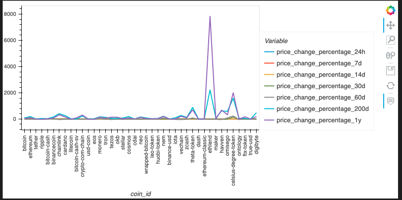
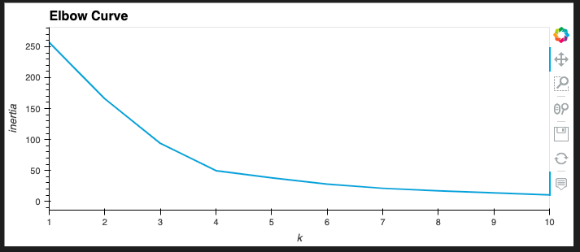
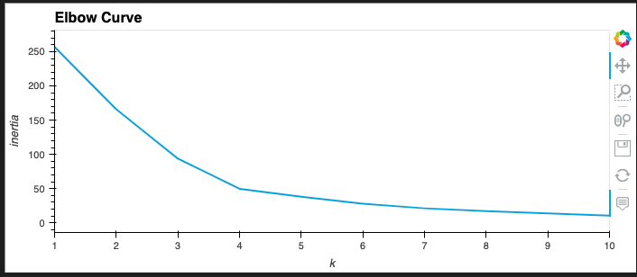
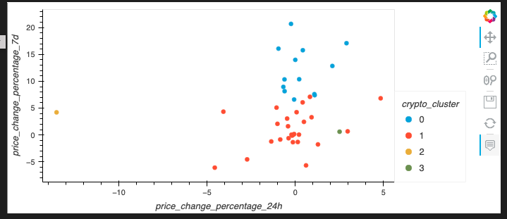

# Columbia Fintech Challenge 10
# Crypto Portfolio Assembly 

## Description

In this Challenge, we assume the role of an advisor in one of the top five financial advisory firms in the world. Competitors are fierce, so we want a novel approach to assembling investment portfolios that are based on cryptocurrencies. Instead of basing our proposal on only returns and volatility, we include other factors that might impact the crypto market—leading to better performance for the portfolio.

we will create a Jupyter notebook that clusters cryptocurrencies by their performance in different time periods. we then plot the results so that you can visually show the performance to the board.


---
## **Methods**
### The code script analysis performed:

    Import the Data from CSV file (provided in the starter code)
        Read the “crypto_market_data.csv” file from the Resources folder into a DataFrame
        
    Prepare the Data
        Generate the summary statistics, and use HvPlot to visualize your data inspect DataFrame contents




* Find the best value for k using the original data
* Cluster cryptocurrencies with K-means using the original data
* Optimize clusters with Principal Component Analysis (PCA)
* Find the best value for k using the Principal Component Analysis (PCA) data
* Cluster the cryptocurrencies with K-means using the Principal Component Analysis (PCA) data
* Visualize and compare the results









---

## Technologies


This project leverages Jupyter Lab v3.4.4 and python v3.9.13 with the following packages:

* [pandas](https://pandas.pydata.org/docs/) - software library written for the python programming language for data manipulation and analysis.

* [hvplot](https://hvplot.holoviz.org/getting_started/hvplot.html) - provides a high-level plotting API built on HoloViews that provides a general and consistent API for plotting data into numerous formats listed within linked documentation.

* [Path](https://pandas.pydata.org/docs/reference/api/pandas.concat.html) - from pathlib - Object-oriented filesystem paths, Path instantiates a concrete path for the platform the code is running on.

* [K-Means](https://scikit-learn.org/stable/modules/clustering.html#k-means) - From scikitlearns cluster, K-Means clustering is one of the most widely used unsupervised machine learning algorithms that form clusters of data based on the similarity between data instances.

* [PCA](https://scikit-learn.org/stable/modules/generated/sklearn.decomposition.PCA.html?highlight=sklearn+decomposition+import+pca) - From scikitlearns decomposition, principal component analysis (PCA); linear dimensionality reduction using Singular Value Decomposition(SVD) of the data to project it to a lower dimensional space, input data is centered but not scaled for each feature before applying the SVD.

* [StandardScaler](https://scikit-learn.org/stable/modules/generated/sklearn.preprocessing.StandardScaler.html?highlight=sklearn+preprocessing+import+standardscaler) - From scikitlearns preprocessing, standardize features by removing the mean and scaling to unit variance.


### Imported Libraries and Dependencies

```python
import pandas as pd
import hvplot.pandas
from pathlib import Path
from sklearn.cluster import KMeans
from sklearn.decomposition import PCA
from sklearn.preprocessing import StandardScaler
```


---
## **Contributors**

### **Author**

Tommy Magee
[LinkedIn](https://www.linkedin.com/in/thomas-magee-2009a72a/)


### **BootCamp lead instructor**

Vinicio De Sola
    [LinkedIn](https://www.linkedin.com/in/vinicio-desola-jr86/)
    [@GitHub](https://github.com/penpen86)


---

## License

MIT License

Copyright (c) [2022] [Thomas 'Tommy' Magee]

Permission is hereby granted, free of charge, to any person obtaining a copy
of this software and associated documentation files (the "Software"), to deal
in the Software without restriction, including without limitation the rights
to use, copy, modify, merge, publish, distribute, sublicense, and/or sell
copies of the Software, and to permit persons to whom the Software is
furnished to do so, subject to the following conditions:

The above copyright notice and this permission notice shall be included in all
copies or substantial portions of the Software.

THE SOFTWARE IS PROVIDED "AS IS", WITHOUT WARRANTY OF ANY KIND, EXPRESS OR
IMPLIED, INCLUDING BUT NOT LIMITED TO THE WARRANTIES OF MERCHANTABILITY,
FITNESS FOR A PARTICULAR PURPOSE AND NONINFRINGEMENT. IN NO EVENT SHALL THE
AUTHORS OR COPYRIGHT HOLDERS BE LIABLE FOR ANY CLAIM, DAMAGES OR OTHER
LIABILITY, WHETHER IN AN ACTION OF CONTRACT, TORT OR OTHERWISE, ARISING FROM,
OUT OF OR IN CONNECTION WITH THE SOFTWARE OR THE USE OR OTHER DEALINGS IN THE
SOFTWARE.

